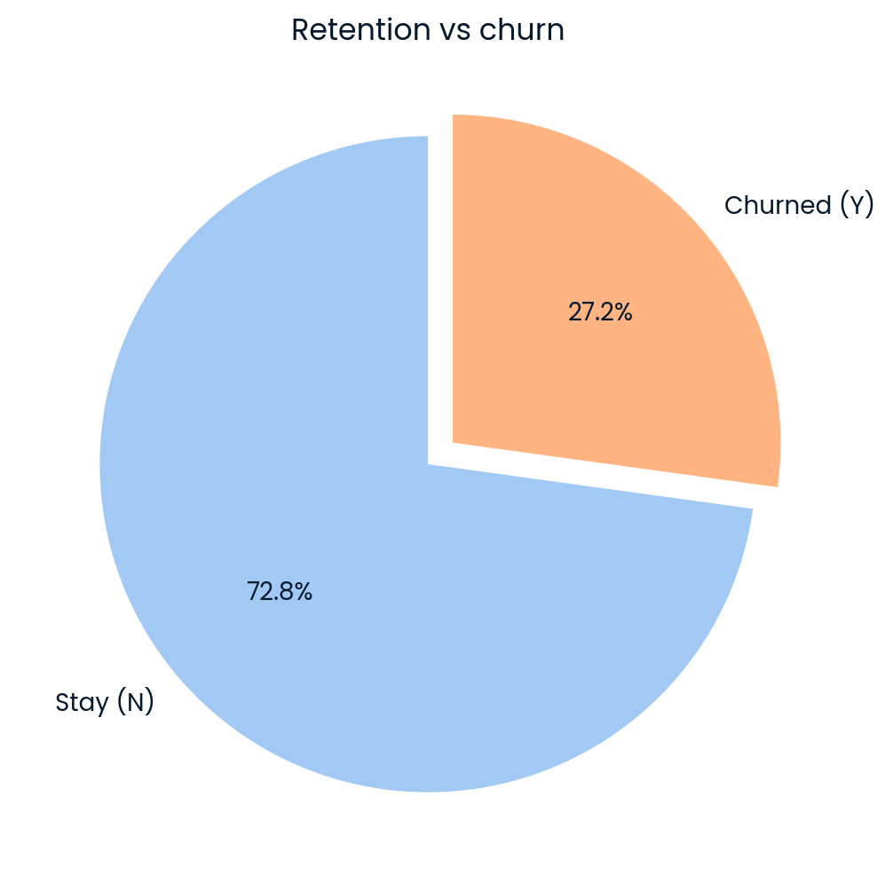
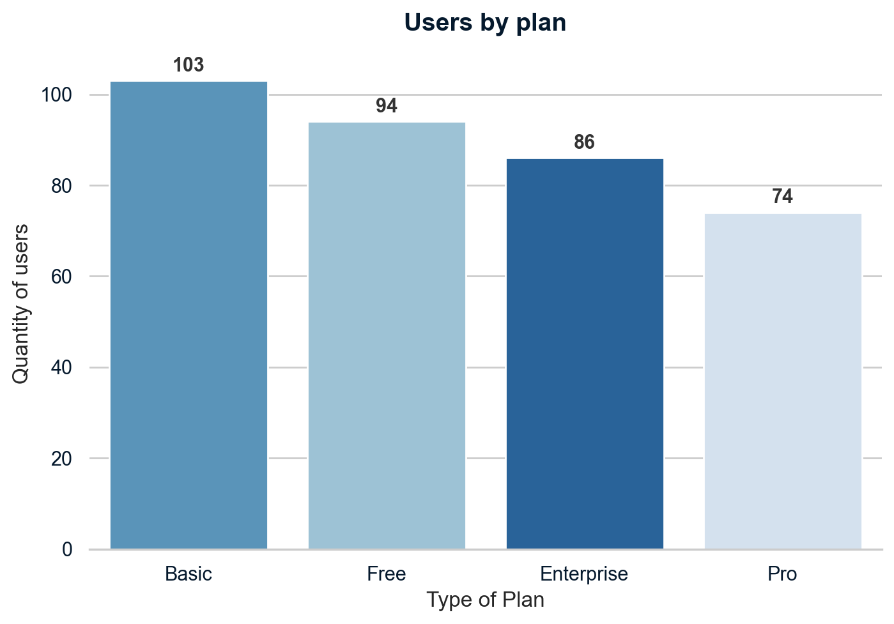
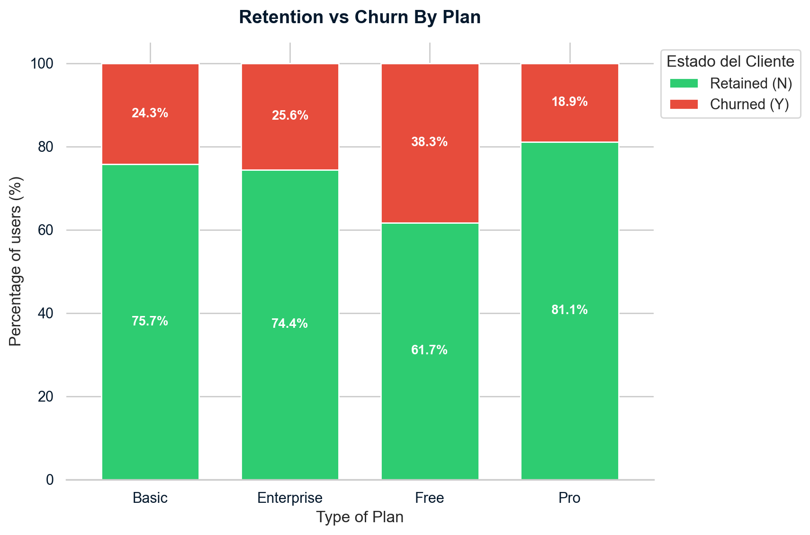
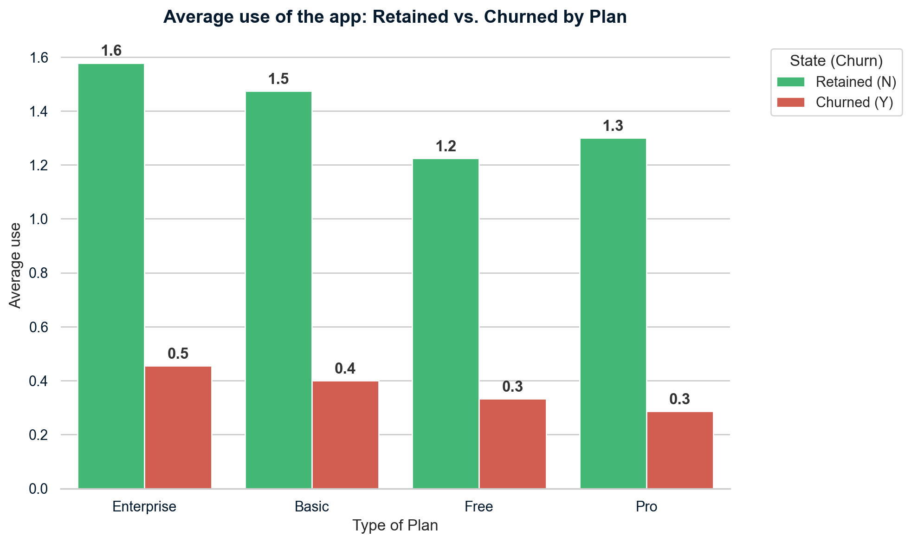
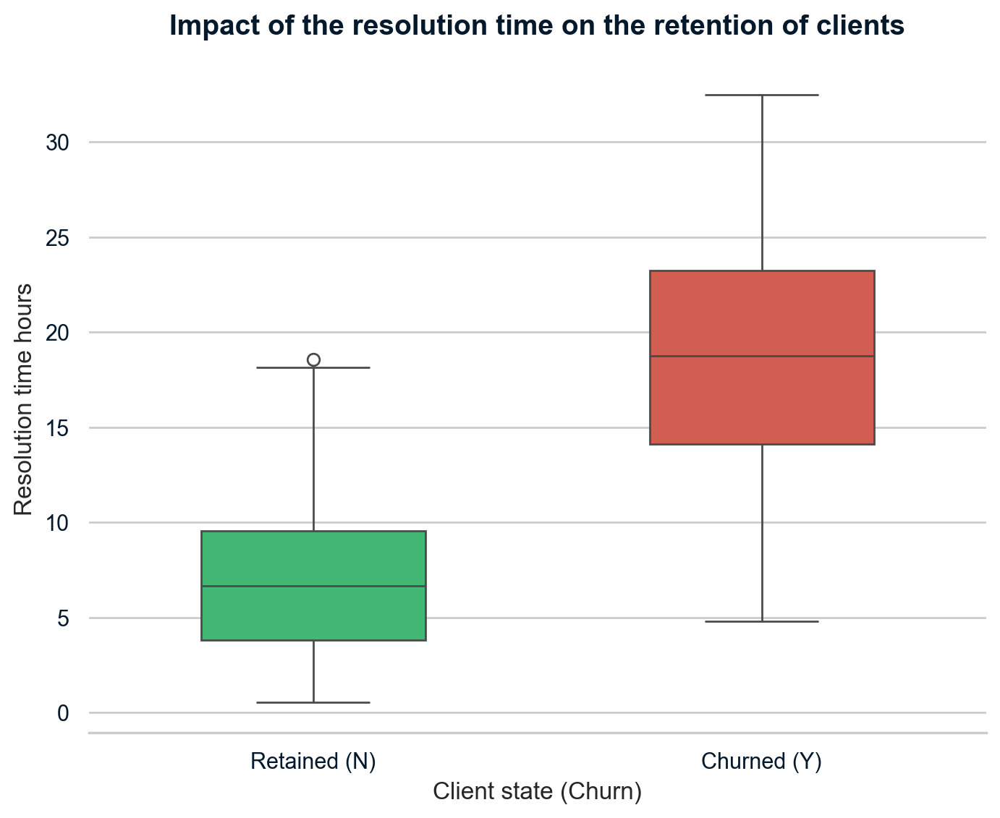

# 📉 Customer Churn Analysis — Fit.ly Subscription Platform

> **DataCamp Data Analyst Professional Certification — Practical Exam**  
> End-to-end analysis of subscription churn using SQL, Python, pandas, matplotlib & seaborn.

---

## 📌 Project Overview

Fit.ly is a US-based fitness app that offers subscription plans (Free, Basic, Pro, Enterprise). The business needed to understand **why users were cancelling their subscriptions** and identify actionable metrics to monitor going forward.

This project covers the full data analyst workflow:
- Multi-table SQL exploration and schema validation
- GDPR-compliant data removal in Python
- Exploratory Data Analysis (EDA) with 5 visualizations
- Business KPI definition with estimated baseline values
- Final recommendations for product, marketing, and support teams

---

## 🗂️ Dataset

Three relational tables provided as CSV files:

| Table | Rows | Description |
|---|---|---|
| `da_fitly_account_info` | 400 | Customer subscription data (plan, price, churn status) |
| `da_fitly_customer_support` | 918 | Support ticket logs (channel, topic, resolution time) |
| `da_fitly_user_activity` | 445 | In-app event logs (track_workout, read_article, etc.) |

---

## 🛠️ Tools & Libraries


---

## 🧹 Data Validation & Cleaning

### `da_fitly_account_info`
| Column | Issue Found | Action Taken |
|---|---|---|
| `customer_id` | Values had a `'C'` prefix (e.g. `C10000`) | Stripped prefix, converted to integer for join compatibility |
| `email` | Checked for nulls | No missing values found — no action required |
| `plan` | Validated 4 categories (Basic, Free, Pro, Enterprise) | No anomalies found |
| `plan_list_price` | Validated price-to-plan consistency | No anomalies found |
| `churn_status` | 286 null values | Nulls treated as active users (N) — filled accordingly |

### `da_fitly_customer_support`
| Column | Issue Found | Action Taken |
|---|---|---|
| `ticket_time` | Checked for duplicate timestamps | All entries confirmed unique |
| `user_id` | Validated as integer to match account table | No issues |
| `resolution_time_hours` | Checked for negatives/outliers | All values within expected range |
| `channel` | 39 records with `'-'` value | Flagged as untracked channel — kept for analysis |
| `comments` | **46 GDPR "right to be forgotten" requests** | **43 unique users fully removed across all 3 tables** |

### `da_fitly_user_activity`
| Column | Issue Found | Action Taken |
|---|---|---|
| `event_time` | Validated timestamp format | No issues |
| `user_id` | Validated as integer | No issues |
| `event_type` | Checked 4 categories for typos | No issues |

### ⚖️ GDPR Compliance Step
Before any analysis, users who submitted data deletion requests in the support `comments` column were identified via SQL and removed from **all three datasets** using Python:

```python
usuarios_gdpr = df_support[df_support['comments'].notna()]['user_id'].unique()
# 43 users identified

df_account_clean  = df_account[~id_numeric.isin(usuarios_gdpr)].copy()
df_support_clean  = df_support[~df_support['user_id'].isin(usuarios_gdpr)].copy()
df_activity_clean = df_activity[~df_activity['user_id'].isin(usuarios_gdpr)].copy()
# Final account table: 357 rows
```

> This step was prioritized before any data exploration to prevent legal exposure for the business.

---

## 📊 Exploratory Data Analysis

### Finding 1 — Overall Churn Rate
The platform has a **27.2% churn rate** across all plans (97 confirmed churned users out of 357 after GDPR cleanup).



---

### Finding 2 — User Distribution by Plan
The **Basic plan** is the most adopted tier (103 users), followed by Free (94), Enterprise (86), and Pro (74). Distribution is relatively balanced, indicating diverse customer segments.



---

### Finding 3 — Churn Rate by Plan
The **Free tier has the highest churn rate at 38.3%** — nearly double that of Pro (18.9%). This is likely driven by the absence of financial commitment, making it frictionless for users to leave without engaging.

| Plan | Retention | Churn |
|---|---|---|
| Pro | 81.1% | **18.9%** |
| Basic | 75.7% | 24.3% |
| Enterprise | 74.4% | 25.6% |
| Free | 61.7% | **38.3%** |



---

### Finding 4 — App Engagement vs Churn
Across all plans, **retained users showed significantly higher in-app activity** than churned users. Enterprise retained users averaged 1.6 events vs 0.5 for churned. This pattern holds across every subscription tier.



> Low engagement is a leading indicator of cancellation — users who don't find value early are most at risk.

---

### Finding 5 — Support Resolution Time vs Churn ⭐ Key Insight
This is the most critical finding. **Churned users experienced median support resolution times of ~18.7 hours**, compared to only ~6.6 hours for retained users — nearly **3x longer**.

Resolution times by topic (median) ranged from 8.3 to 9.4 hours — all above the 7-hour threshold at which retention becomes significantly more likely.



---

## 📐 Business KPI Definition

**Recommended Primary Metric: Median Resolution Time (MRT)**

| | Value |
|---|---|
| Current overall MRT | **8.9 hours** |
| MRT for retained users | **~6.6 hours** |
| MRT for churned users | **~18.7 hours** |
| **Recommended SLA target** | **< 7 hours** |

**How to monitor:**  
Implement a real-time dashboard tracking MRT daily, segmented by channel (phone, chat, email). Set automated alerts when any open ticket approaches the 7-hour mark. Tickets arriving without a channel (`'-'`) should be investigated — they appear to be getting lost in the queue.

---

## ✅ Final Recommendations

**1. Overhaul Support Operations**  
Support delays are the primary driver of churn. Optimize the queue to resolve all tickets within 7 hours. Prioritize tickets with no assigned channel (`'-'`), which are likely falling through the cracks.

**2. Launch Re-engagement Campaigns**  
Low app usage reliably predicts cancellation. Implement automated push notifications and email workflows targeting users who haven't logged an event within their first 3–5 days.

**3. Force the "Aha!" Moment during Onboarding**  
Retained users consistently log `track_workout` events. Redesign the onboarding flow — especially for Free tier users — to guide them to track their first workout immediately. Creating this habit early significantly raises perceived value before a cancellation decision is made.

---

## 📁 Repository Structure

```
fitly-churn-analysis/
│
├── notebook.ipynb          # Full analysis notebook (SQL + Python)
├── README.md               # This file
│
└── charts/                 # Exported visualizations
    ├── retention_vs_churn.png
    ├── users_by_plan.png
    ├── churn_by_plan.png
    ├── app_usage_vs_churn.png
    └── resolution_time_vs_churn.png
```

---

## 🚀 How to Run

1. Clone this repository
2. Open `notebook.ipynb` in [DataCamp DataLab](https://www.datacamp.com/datalab) or Jupyter
3. The three CSV datasets are loaded directly via DuckDB SQL — no local files needed if using DataLab
4. Run all cells in order

---

## 👤 Author

**Leonardo Farfán**  
Associate Data Analyst · DataCamp Certified  
[LinkedIn](https://linkedin.com/in/leofarfan) · [Email](mailto:leofarfan2604@gmail.com)

---

*This project was completed as part of the DataCamp Data Analyst Professional Certification practical exam.*
